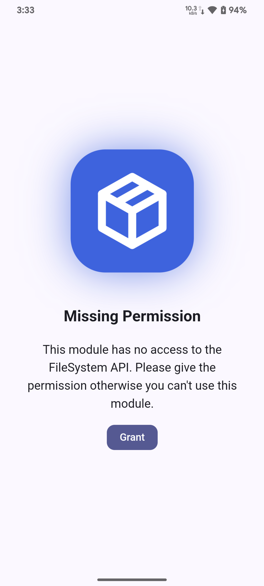
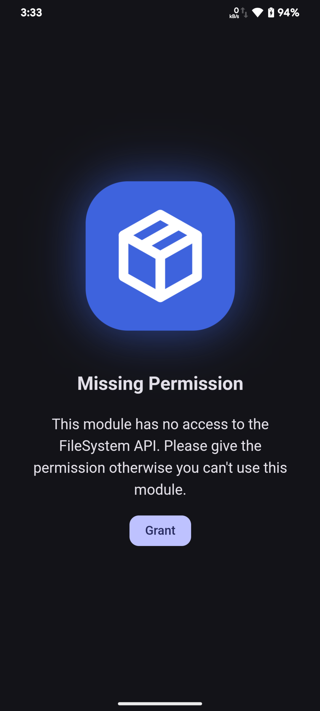
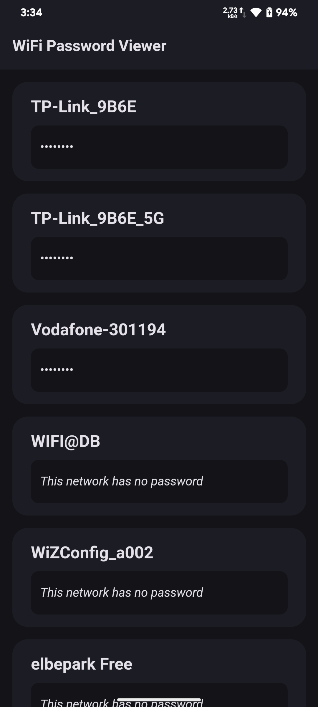

# WiFi Password Viewer for MMRL

An inspired project from [veez21](https://github.com/veez21)'s [wpd gist](https://gist.github.com/veez21/4f2541d271809864411e3ffbbe8e3df9), ported to MMRL.

<a href="https://mmrl.dev/repository/grdoglgmr/mmrl_wpd"></a>

Using `DOMParser` to extract local saved wifi passwords

> [!IMPORTANT]
> This project requires MMRL above 33162!

```js
const wifiXmlParser = new DOMParser();
```

> This module does not extract passwords from unauthorized wifi's. This module is for education purpose only

## Screenshots

<p>
  
  
  
  
  
  
</p>
